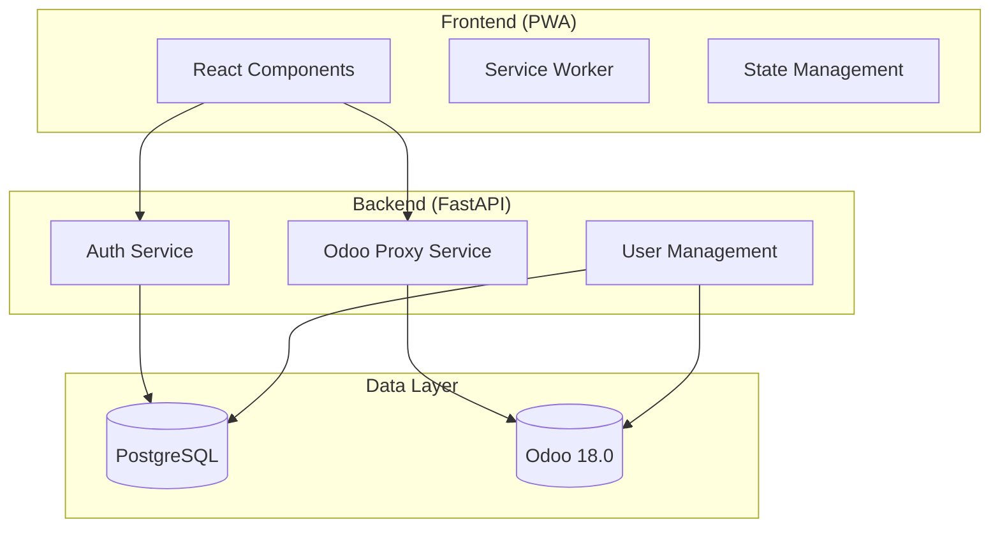
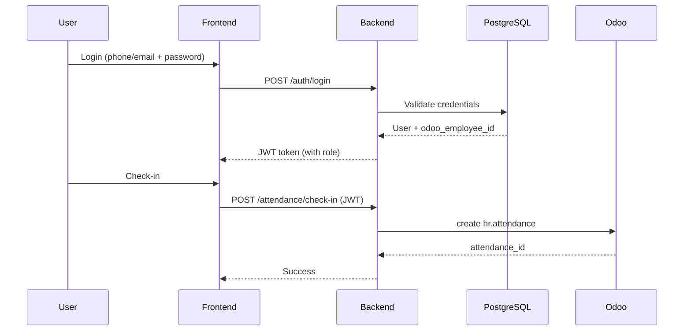

# Design Document - Bestmix Pro HR

## Overview

Bestmix Pro là hệ thống quản lý nhân sự nội bộ với kiến trúc 3-tier:
- **Frontend**: ReactJS + Vite PWA (Mobile-first)
- **Backend**: FastAPI proxy server
- **Data Layer**: PostgreSQL (local users) + Odoo 18.0 (HR data via XML-RPC)

Backend đóng vai trò proxy, xử lý authentication local và forward HR operations tới Odoo. Attendance và Leave data được lưu trực tiếp trên Odoo, không cache local.

## Architecture



### Request Flow



## Components and Interfaces

### Backend Components

#### 1. Auth Service
- **Purpose**: Handle user authentication and JWT management
- **Endpoints**:
  - `POST /auth/login` - Authenticate user
  - `POST /auth/logout` - Invalidate token
  - `POST /auth/refresh` - Refresh JWT token

#### 2. Odoo Proxy Service
- **Purpose**: Abstract Odoo XML-RPC calls
- **Methods**:
  - `execute_kw(model, method, args, kwargs)` - Generic Odoo call
  - Connection pooling for performance

#### 3. Attendance Service
- **Purpose**: Handle attendance operations
- **Endpoints**:
  - `POST /attendance/check-in` - Create attendance record
  - `POST /attendance/check-out` - Update attendance with check_out
  - `GET /attendance/history` - Get attendance list
  - `GET /attendance/summary` - Get monthly summary
  - `GET /attendance/status` - Get current check-in status

#### 4. Leave Service
- **Purpose**: Handle leave request operations
- **Endpoints**:
  - `POST /leave/request` - Create leave request (draft)
  - `POST /leave/{id}/confirm` - Confirm leave request
  - `POST /leave/{id}/approve` - Manager approve (validate)
  - `POST /leave/{id}/reject` - Manager reject (refuse)
  - `GET /leave/history` - Get leave history
  - `GET /leave/balance` - Get leave balance
  - `GET /leave/types` - Get leave types
  - `GET /leave/pending` - Manager: get pending requests

#### 5. Profile Service
- **Purpose**: Handle employee profile operations
- **Endpoints**:
  - `GET /profile` - Get current user profile
  - `PUT /profile` - Update allowed fields
  - `GET /profile/contract` - Get contract info

#### 6. User Management Service
- **Purpose**: Admin user CRUD operations
- **Endpoints**:
  - `GET /users` - List users (admin)
  - `POST /users` - Create user (admin)
  - `PUT /users/{id}` - Update user (admin)
  - `DELETE /users/{id}` - Delete user (admin)
  - `GET /team` - Manager: get team members

### Frontend Components

#### 1. Auth Module
- Login page (phone/email + password)
- Token management (storage, refresh)
- Protected route wrapper

#### 2. Attendance Module
- Check-in/Check-out button with status
- Current session timer
- Attendance history list
- Monthly summary view

#### 3. Leave Module
- Leave request form
- Leave balance display
- Leave history with status
- Manager: Pending approvals list

#### 4. Profile Module
- Profile view/edit form
- Contract information (read-only)

#### 5. Admin Module
- User management CRUD
- Team view (for managers)

## Data Models

### PostgreSQL Models (Local)

```python
# User model - stored locally
class User:
    id: int  # Primary key
    email: str | None  # Unique, nullable
    phone: str | None  # Unique, nullable
    password_hash: str  # bcrypt hashed
    role: str  # 'employee' | 'manager' | 'admin'
    odoo_employee_id: int  # FK to Odoo hr.employee
    is_active: bool
    created_at: datetime
    updated_at: datetime
```

### Odoo Models (Reference)

```python
# hr.employee - Read from Odoo
class OdooEmployee:
    id: int
    name: str
    work_email: str
    mobile_phone: str
    department_id: tuple[int, str]  # (id, name)
    job_id: tuple[int, str]
    parent_id: tuple[int, str] | None  # Manager
    birthday: date | None
    identification_id: str | None

# hr.attendance - Write to Odoo
class OdooAttendance:
    id: int
    employee_id: tuple[int, str]
    check_in: datetime
    check_out: datetime | None
    worked_hours: float

# hr.leave - Write to Odoo
class OdooLeave:
    id: int
    employee_id: tuple[int, str]
    holiday_status_id: tuple[int, str]  # Leave type
    request_date_from: date
    request_date_to: date
    state: str  # 'draft' | 'confirm' | 'validate' | 'refuse'
    number_of_days: float
    name: str  # Description

# hr.leave.type - Read from Odoo
class OdooLeaveType:
    id: int
    name: str
    allocation_type: str

# hr.leave.allocation - Read from Odoo
class OdooLeaveAllocation:
    id: int
    employee_id: tuple[int, str]
    holiday_status_id: tuple[int, str]
    number_of_days: float
    leaves_taken: float
    remaining_leaves: float

# hr.contract - Read from Odoo
class OdooContract:
    id: int
    employee_id: tuple[int, str]
    name: str
    wage: float
    state: str  # 'draft' | 'open' | 'close' | 'cancel'
    date_start: date
    date_end: date | None
    job_id: tuple[int, str]
    department_id: tuple[int, str]
```

### API Response Models

```python
# JWT Token payload
class TokenPayload:
    sub: int  # user_id
    role: str
    odoo_employee_id: int
    exp: datetime

# API Response wrapper
class APIResponse[T]:
    success: bool
    data: T | None
    error: str | None
```


## Error Handling

### Backend Error Strategy

```python
# Custom exceptions
class OdooConnectionError(Exception):
    """Raised when Odoo is unreachable"""
    
class OdooAPIError(Exception):
    """Raised when Odoo returns an error"""
    
class AuthenticationError(Exception):
    """Raised for auth failures"""
    
class AuthorizationError(Exception):
    """Raised for permission denied"""

# Error response format
class ErrorResponse:
    success: bool = False
    error: str
    error_code: str  # 'ODOO_UNAVAILABLE', 'INVALID_CREDENTIALS', etc.
```

### Error Codes

| Code | HTTP Status | Description |
|------|-------------|-------------|
| `INVALID_CREDENTIALS` | 401 | Wrong email/phone or password |
| `TOKEN_EXPIRED` | 401 | JWT token expired |
| `FORBIDDEN` | 403 | User lacks permission |
| `ODOO_UNAVAILABLE` | 503 | Cannot connect to Odoo |
| `ODOO_ERROR` | 502 | Odoo returned an error |
| `VALIDATION_ERROR` | 400 | Invalid input data |
| `DUPLICATE_CHECKIN` | 400 | Already checked in |
| `LEAVE_OVERLAP` | 400 | Leave dates overlap |

### Frontend Error Handling

- Display user-friendly error messages
- Show retry button for network errors
- Redirect to login on 401
- Show permission denied message on 403

## Testing Strategy

### Dual Testing Approach

This project uses both unit tests and property-based tests:
- **Unit tests**: Verify specific examples and edge cases
- **Property-based tests**: Verify universal properties across all inputs

### Property-Based Testing Library

- **Backend (Python)**: `hypothesis` library
- **Frontend (TypeScript)**: `fast-check` library

### Test Configuration

- Property tests: minimum 100 iterations per property
- Each property test must reference the correctness property from design document
- Format: `**Feature: bestmix-pro-hr, Property {number}: {property_text}**`

### Unit Test Coverage

1. **Auth Service**
   - Login with valid/invalid credentials
   - Token generation and validation
   - Role extraction from JWT

2. **Odoo Proxy Service**
   - Connection handling
   - Error response parsing
   - Retry logic

3. **Attendance Service**
   - Check-in/check-out flow
   - Duplicate check-in prevention
   - History retrieval

4. **Leave Service**
   - Leave request creation
   - State transitions
   - Balance calculation

5. **RBAC**
   - Permission checks per role
   - Endpoint access control


## Correctness Properties

*A property is a characteristic or behavior that should hold true across all valid executions of a system-essentially, a formal statement about what the system should do. Properties serve as the bridge between human-readable specifications and machine-verifiable correctness guarantees.*

### Property 1: JWT Token Contains Correct Role
*For any* user with a valid role (employee, manager, admin), when authentication succeeds, the returned JWT token payload SHALL contain the exact role assigned to that user.
**Validates: Requirements 1.1, 1.6**

### Property 2: Invalid Credentials Rejection
*For any* login attempt with invalid credentials (wrong password, non-existent email/phone), the system SHALL reject the attempt and return an error within the specified time limit.
**Validates: Requirements 1.2**

### Property 3: Attendance Record Consistency
*For any* check-in operation followed by check-out, the hr.attendance record in Odoo SHALL have both check_in and check_out timestamps, and worked_hours SHALL equal the difference between check_out and check_in.
**Validates: Requirements 2.1, 2.2**

### Property 4: Attendance History Ordering
*For any* list of attendance records returned by the history endpoint, the records SHALL be sorted by check_in date in descending order.
**Validates: Requirements 2.3**

### Property 5: Duplicate Check-in Prevention
*For any* employee with an active check-in (check_out is null), attempting another check-in SHALL be rejected.
**Validates: Requirements 2.6**

### Property 6: Attendance Summary Accuracy
*For any* set of attendance records in a month, the displayed total working hours SHALL equal the sum of worked_hours from all records in that month.
**Validates: Requirements 2.7**

### Property 7: Leave Request State Transitions
*For any* leave request, the state transitions SHALL follow the valid flow: draft → confirm → (validate | refuse). Invalid transitions SHALL be rejected.
**Validates: Requirements 3.1, 3.2, 3.8, 3.9**

### Property 8: Leave Balance Calculation
*For any* leave allocation, the remaining_days SHALL equal allocated_days minus used_days.
**Validates: Requirements 3.3**

### Property 9: Leave Date Validation
*For any* leave request with invalid dates (end_date < start_date, or dates in the past), the system SHALL reject the request.
**Validates: Requirements 3.5**

### Property 10: Leave Overlap Detection
*For any* new leave request that overlaps with an existing approved leave (date ranges intersect), the system SHALL detect and warn the user.
**Validates: Requirements 3.7**

### Property 11: Manager Department Scope
*For any* manager viewing pending leave requests, the system SHALL only return requests from employees in the manager's department.
**Validates: Requirements 3.10, 6.6**

### Property 12: User-Odoo Employee Link Validation
*For any* user creation with odoo_employee_id, the system SHALL validate that the ID exists in Odoo hr.employee before creating the user.
**Validates: Requirements 5.6, 6.1, 6.3**

### Property 13: Password Hashing
*For any* password stored in the database, the stored value SHALL be a valid bcrypt hash, not the plaintext password.
**Validates: Requirements 6.5**

### Property 14: Role-Based Access Control
*For any* API request, the system SHALL enforce access control based on user role: employees can only access own data, managers can access team data and approve leaves, admins have full access. Unauthorized access SHALL return 403.
**Validates: Requirements 7.1, 7.2, 7.3, 7.4**

### Property 15: JSON Serialization Round-Trip
*For any* data object (User, Attendance, Leave, Profile), serializing to JSON and deserializing back SHALL produce an equivalent object.
**Validates: Requirements 9.1**

### Property 16: DateTime ISO 8601 Format
*For any* datetime value in API responses, the serialized format SHALL be valid ISO 8601 with timezone information.
**Validates: Requirements 9.3**

