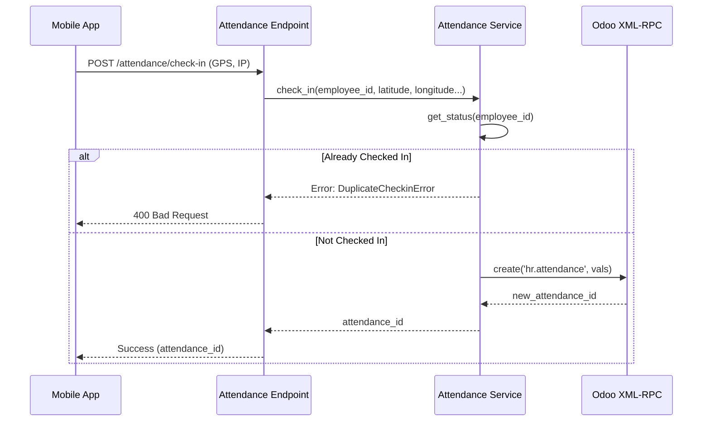
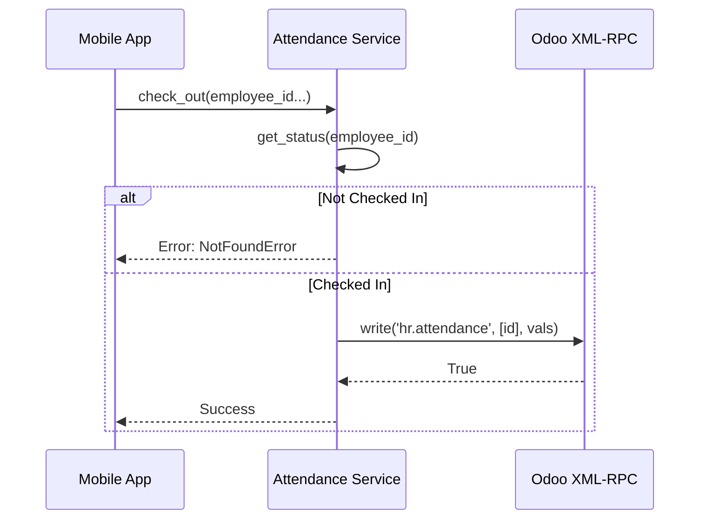

# Giải thích Luồng Chấm công (Attendance Flow)

Tài liệu này mô tả chi tiết quy trình xử lý chấm công (Check-in/Check-out) trong hệ thống **Bestmix Pro**, từ Mobile App xuống Backend và đồng bộ sang Odoo.

## Tổng quan

Hệ thống chấm công bao gồm các chức năng chính:

1.  **Check-in**: Ghi nhận giờ vào làm.
2.  **Check-out**: Ghi nhận giờ ra về.
3.  **Lịch sử**: Xem danh sách chấm công.
4.  **Tổng hợp**: Tính tổng giờ công trong tháng.

---

## 1. Luồng Check-in

### Sơ đồ tuần tự

### Chi tiết xử lý (`AttendanceService.check_in`)

1.  **Kiểm tra trạng thái (Validation)**:

    - Hàm `get_status(odoo_employee_id)` được gọi để xem nhân viên có đang trong trạng thái "Check-in" (chưa check-out) hay không.
    - Logic: Tìm bản ghi `hr.attendance` có `employee_id` khớp và `check_out` là `False`.
    - Nếu tìm thấy -> Ném lỗi `DuplicateCheckinError` để chặn check-in 2 lần liên tiếp.

2.  **Chuẩn bị dữ liệu**:

    - Tạo dictionary `vals` chứa:
      - `employee_id`: ID nhân viên trong Odoo.
      - `in_latitude`, `in_longitude`: Tọa độ GPS (nếu có).
      - `in_ip_address`: Địa chỉ IP mạng.
      - `in_mode`: Cách thức check-in (manual/face_id...).

3.  **Ghi xuống Odoo**:
    - Sử dụng `odoo_client.execute_kw('hr.attendance', 'create', [vals])`.
    - Odoo sẽ tạo bản ghi mới và tự động đánh dấu thời gian `check_in` là thời điểm hiện tại (theo server Odoo).

---

## 2. Luồng Check-out

### Check-out Flow

### Chi tiết xử lý (`AttendanceService.check_out`)

1.  **Tìm phiên làm việc mở**:

    - Gọi `get_status` để lấy `id` của bản ghi attendance đang mở (chưa có `check_out`).
    - Nếu không tìm thấy -> Ném lỗi `NotFoundError` (người dùng chưa check-in nên không thể check-out).

2.  **Cập nhật dữ liệu**:
    - Lấy thời gian hiện tại (`datetime.utcnow()`).
    - Chuẩn bị dictionary `vals` chứa:
      - `check_out`: Thời gian hiện tại.
      - `out_latitude`, `out_longitude`: Tọa độ lúc về.
3.  **Ghi xuống Odoo**:
    - Sử dụng `odoo_client.execute_kw('hr.attendance', 'write', [[attendance_id], vals])`.
    - Odoo sẽ tính toán field `worked_hours` (số giờ làm việc) dựa trên `check_out` - `check_in`.

---

## 3. Lấy Lịch sử & Tổng hợp

### Lịch sử (`get_history`)

- **Mục tiêu**: Lấy danh sách chấm công để hiển thị trên app.
- **Odoo Query**:
  - Model: `hr.attendance`
  - Domain: `[['employee_id', '=', id]]`
  - Order: `check_in desc` (Mới nhất lên đầu).
  - Limit: Mặc định 30 bản ghi.

### Tổng hợp công tháng (`get_summary`)

- **Mục tiêu**: Tính tổng giờ làm việc trong tháng.
- **Logic**:
  1.  Xác định ngày đầu tháng (`start_date`) và ngày đầu tháng sau (`end_date`).
  2.  Query Odoo `hr.attendance` với điều kiện thời gian:
      - `check_in >= start_date`
      - `check_in < end_date`
  3.  Backend Python thực hiện vòng lặp tính tổng field `worked_hours` từ các bản ghi trả về.
  4.  Trả về: `total_hours` và `attendance_count` (số công).
