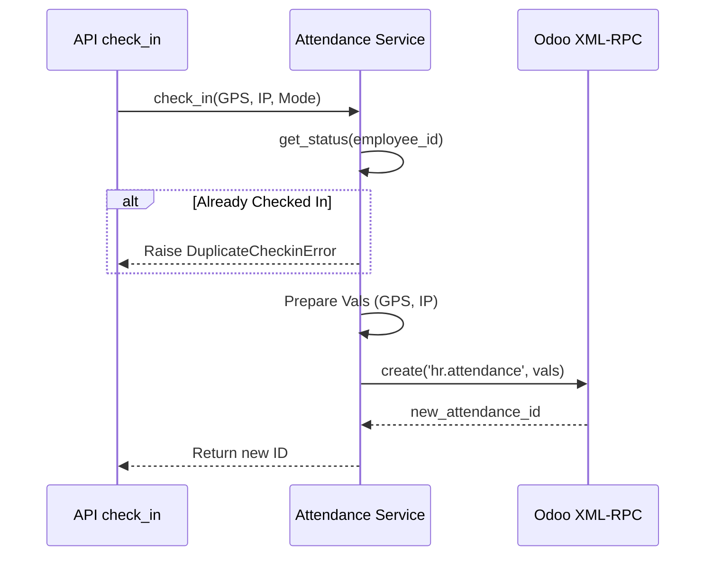
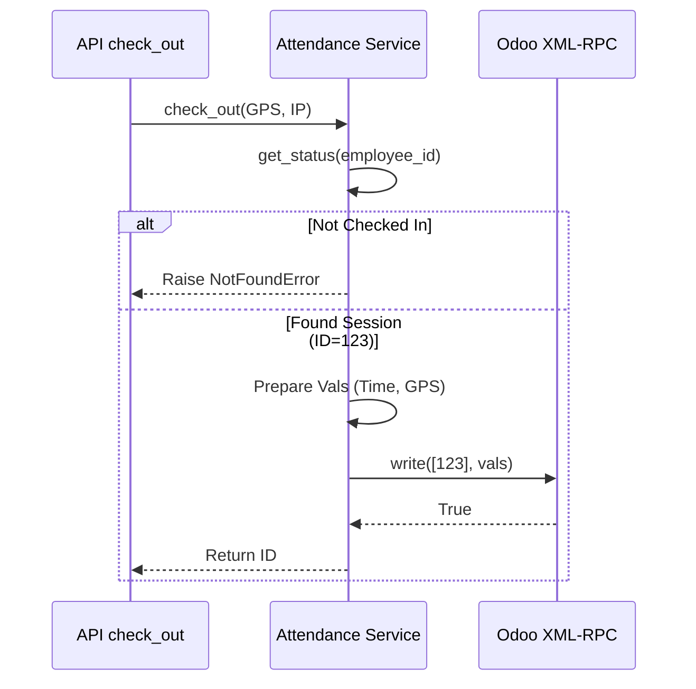

# Giải thích Luồng Chấm công (Attendance Flow)

Tài liệu này phân tích chi tiết mã nguồn của **`AttendanceService`** (`backend/app/services/attendance_service.py`), giải thích cách hệ thống xử lý logic chấm công và đồng bộ dữ liệu với Odoo.

## 1. Class `AttendanceService`

Class này đóng vai trò Facade pattern, che giấu sự phức tạp của việc gọi API Odoo (XML-RPC), cung cấp các phương thức nghiệp vụ dễ hiểu cho API Layer.

### Các hàm chính:

- **`check_in`**: Tạo bản ghi chấm công.
- **`check_out`**: Kết thúc bản ghi chấm công.
- **`get_status`**: Kiểm tra trạng thái hiện tại.
- **`get_summary`**: Tính tổng công tháng.

---

## 2. Luồng Check-in (`check_in`)

Hàm này xử lý việc nhân viên bắt đầu ca làm việc.

### Sơ đồ Logic



### Chi tiết Code

(`backend/app/services/attendance_service.py`)

#### Bước 1: Validation (Chặn Check-in kép)

```python
current_status = self.get_status(odoo_employee_id)
if current_status:
    raise DuplicateCheckinError()
```

- **Mục đích**: Ngăn nhân viên ấn check-in 2 lần liên tiếp mà chưa check-out.
- **Hoạt động**: Gọi hàm `get_status` để xem có bản ghi nào chưa có giờ về (`check_out = False`) không.

#### Bước 2: Chuẩn bị dữ liệu (Data Mapping)

```python
vals = {
    'employee_id': odoo_employee_id,
    'in_latitude': latitude,    # Lưu tọa độ GPS lúc vào
    'in_longitude': longitude,
    'in_ip_address': ip_address,# Lưu IP mạng
    'in_mode': mode             # 'manual', 'face_id', v.v.
}
```

- Dữ liệu này được mapping đúng theo tên field trong model `hr.attendance` của Odoo.

#### Bước 3: Ghi xuống Odoo

```python
attendance_id = odoo_client.execute_kw('hr.attendance', 'create', [vals])
```

- **Lệnh**: `create`.
- **Kết quả**: Odoo tự động điền `check_in` là thời gian server hiện tại. Trả về ID của dòng vừa tạo.

---

## 3. Luồng Check-out (`check_out`)

Hàm này cập nhật giờ ra cho bản ghi đang mở.

### Sơ đồ Logic



### Chi tiết Code

#### Bước 1: Tìm phiên đang mở

```python
current_status = self.get_status(odoo_employee_id)
if not current_status:
    raise NotFoundError("Employee is not checked in")
attendance_id = current_status['id']
```

- **Logic**: Không thể check-out nếu chưa check-in. Hệ thống cần `id` của dòng check-in trước đó để update.

#### Bước 2: Chuẩn bị dữ liệu update

```python
now = datetime.utcnow().strftime('%Y-%m-%d %H:%M:%S')
vals = {
    'check_out': now,           # Thời gian ra (UTC)
    'out_latitude': latitude,
    'out_longitude': longitude,
    ...
}
```

- **Lưu ý**: Odoo thường lưu thời gian trong Database dưới dạng UTC.

#### Bước 3: Ghi xuống Odoo

```python
odoo_client.execute_kw('hr.attendance', 'write', [[attendance_id], vals])
```

- **Lệnh**: `write` (Update).
- **Tham số**: List các ID cần sửa `[attendance_id]` và dictionary giá trị mới `vals`.
- **Hệ quả**: Odoo sẽ tự động tính toán field `worked_hours` = `check_out` - `check_in`.

---

## 4. Hàm bổ trợ `get_status`

Đây là hàm quan trọng được dùng đi dùng lại.

```python
domain = [
    ['employee_id', '=', odoo_employee_id],
    ['check_out', '=', False]  # Quan trọng: Tìm dòng chưa có giờ ra
]
records = odoo_client.search_read('hr.attendance', domain, ['id', 'check_in'], limit=1)
```

- **Logic**: Một nhân viên tại 1 thời điểm chỉ có tối đa 1 bản ghi `check_out = False`. Nếu tìm thấy, nghĩa là họ đang làm việc.

---

## 5. Luồng Tổng hợp Công (`get_summary`)

Hàm này tính tổng giờ làm trong tháng (để hiển thị dashboard).

### Logic tính toán

Do Odoo 18.0 có thể không có sẵn hàm tính tổng qua API, service này thực hiện tính toán thủ công (client-side aggregation):

1.  **Xác định khoảng thời gian (Date Range)**:

    - Đầu tháng: Ngày 1 của tháng hiện tại.
    - Cuối tháng: Ngày 1 của tháng kế tiếp.

    ```python
    start_date = datetime(year, month, 1)
    end_date = datetime(year + 1, 1, 1) # Nếu tháng 12 thì qua năm sau
    ```

2.  **Query Odoo**:

    - Lấy tất cả các dòng check-in nằm trong khoảng `[start_date, end_date)`.
    - Chỉ lấy field `worked_hours` để tối ưu tốc độ.

3.  **Tính tổng (Sum Loop)**:
    ```python
    total_hours = sum(r.get('worked_hours', 0.0) for r in records)
    ```
    - Cộng dồn giá trị `worked_hours` (số thực) mà Odoo đã tính sẵn cho từng dòng.

---

## 6. Lấy Lịch sử (`get_history`)

```python
def get_history(self, odoo_employee_id: int, limit: int = 30) -> List[dict]:
    domain = [['employee_id', '=', odoo_employee_id]]
    return odoo_client.execute_kw(
        'hr.attendance', 'search_read', [domain],
        {'fields': ['check_in', 'check_out', 'worked_hours'], 'limit': limit, 'order': 'check_in desc'}
    )
```

- **Mục đích**: Lấy danh sách chấm công để hiển thị lên App.
- **Logic**:
  - **Filter**: Chỉ lấy của nhân viên đó.
  - **Order**: `check_in desc` (Mới nhất lên đầu) để nhân viên thấy ngày hôm nay trước.
  - **Limit**: Mặc định 30 dòng (khoảng 1 tháng làm việc) để tối ưu tốc độ load.
