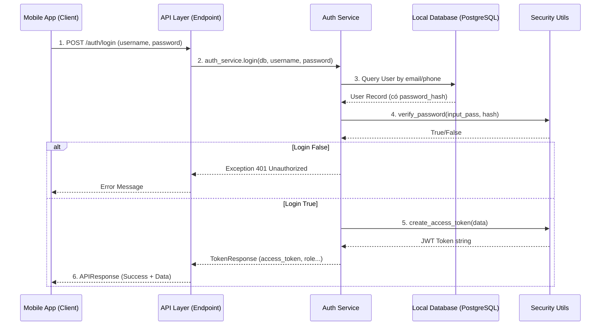

# Giải thích Luồng Xác thực (Authentication Flow)

Tài liệu này giải thích chi tiết cơ chế đăng nhập của hệ thống **Bestmix Pro**, đi từ lúc ứng dụng Mobile gửi yêu cầu cho đến khi nhận được kết quả.

## Sơ đồ Tổng quan



## Chi tiết từng bước xử lý

### 1. Client Gửi Yêu cầu (`LoginRequest`)

- **Hành động**: Người dùng nhập Email/SĐT và Mật khẩu trên app, nhấn "Đăng nhập".
- **Dữ liệu gửi đi**: JSON body chứa `username` (là email hoặc sđt) và `password`.
- **Đích đến**: Endpoint `/auth/login` trên Backend.

### 2. API Layer - Tiếp nhận (`backend/app/api/endpoints/auth.py`)

Khi request đến, hàm `login` sẽ được kích hoạt:

```python
@router.post("/login", ...)
def login(user_in: LoginRequest, db: Session = Depends(deps.get_db)):
    token = auth_service.login(db=db, username=user_in.username, password=user_in.password)
    return APIResponse(data=token)
```

- **Nhiệm vụ**:
  - Validate dữ liệu đầu vào (nhờ `LoginRequest` schema).
  - Gọi xuống tầng Service để xử lý logic chính: `auth_service.login()`.
  - Nhận kết quả và đóng gói vào `APIResponse` chuẩn.

### 3. Service Layer - Xử lý nghiệp vụ (`backend/app/services/auth_service.py`)

Đây là "bộ não" xử lý logic. Hàm `login` thực hiện 2 việc chính: Xác thực và Tạo Token.

#### A. Hàm `authenticate` - Kiểm tra thông tin

```python
def authenticate(self, db: Session, username: str, password: str) -> Optional[User]:
    # 1. Tìm user trong DB theo email HOẶC phone
    user = db.query(User).filter(
        or_(User.email == username, User.phone == username)
    ).first()

    if not user:
        return None  # Không tìm thấy user

    # 2. Kiểm tra mật khẩu
    if not security.verify_password(password, user.password_hash):
        return None  # Mật khẩu sai

    return user  # Hợp lệ
```

- **Giải thích**: Hệ thống tìm user trong Database. Nếu có, nó lấy `password_hash` (mật khẩu đã mã hóa) từ DB ra và so sánh với mật khẩu người dùng nhập vào (bằng hàm `verify_password`).

#### B. Hàm `login` - Điều phối chung

```python
def login(self, db: Session, username: str, password: str) -> TokenResponse:
    # Gọi hàm authenticate ở trên
    user = self.authenticate(db, username, password)
    if not user:
        # Nếu sai thì báo lỗi ngay lại cho API
        raise HTTPException(status_code=401, detail="Incorrect email/phone or password")

    # Nếu đúng, tạo Token
    access_token = security.create_access_token(
        data={"sub": str(user.id), "role": user.role, "odoo_employee_id": user.odoo_employee_id}
    )

    # Trả về kết quả
    return {
        "access_token": access_token,
        "token_type": "bearer",
        ...
    }
```

### 4. Security Layer - Tiện ích bảo mật (`backend/app/core/security.py`)

Các hàm tiện ích được Service gọi đến:

- **`verify_password(plain, hashed)`**: Dùng thư viện `passlib[bcrypt]` để băm mật khẩu người dùng nhập vào và so sánh với chuỗi hash trong DB. **Tuyệt đối không so sánh chuỗi plain text trực tiếp.**
- **`create_access_token(data)`**: Dùng thư viện `python-jose` để tạo chuỗi JWT.
  - **Payload**: Chứa `sub` (user id), `role` (quyền hạn), `odoo_employee_id` (mã nhân viên Odoo).
  - **Signature**: Được ký bằng `SECRET_KEY` của server để đảm bảo không ai có thể làm giả token này.

### 5. Phản hồi về Client

Cuối cùng, API trả về JSON cho Mobile App:

```json
{
  "success": true,
  "data": {
    "access_token": "eyJhbGciOiJIUzI1NiIs...",
    "token_type": "bearer",
    "role": "employee",
    "odoo_employee_id": 123
  },
  "error": null
}
```

Mobile App sẽ lưu `access_token` này và đính kèm vào header của các request sau (`Authorization: Bearer <token>`) để chứng minh danh tính.
