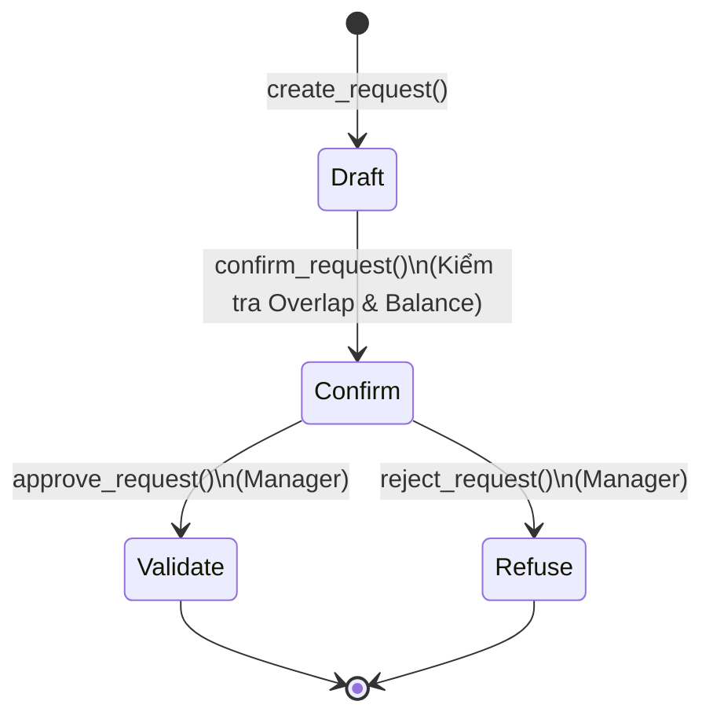
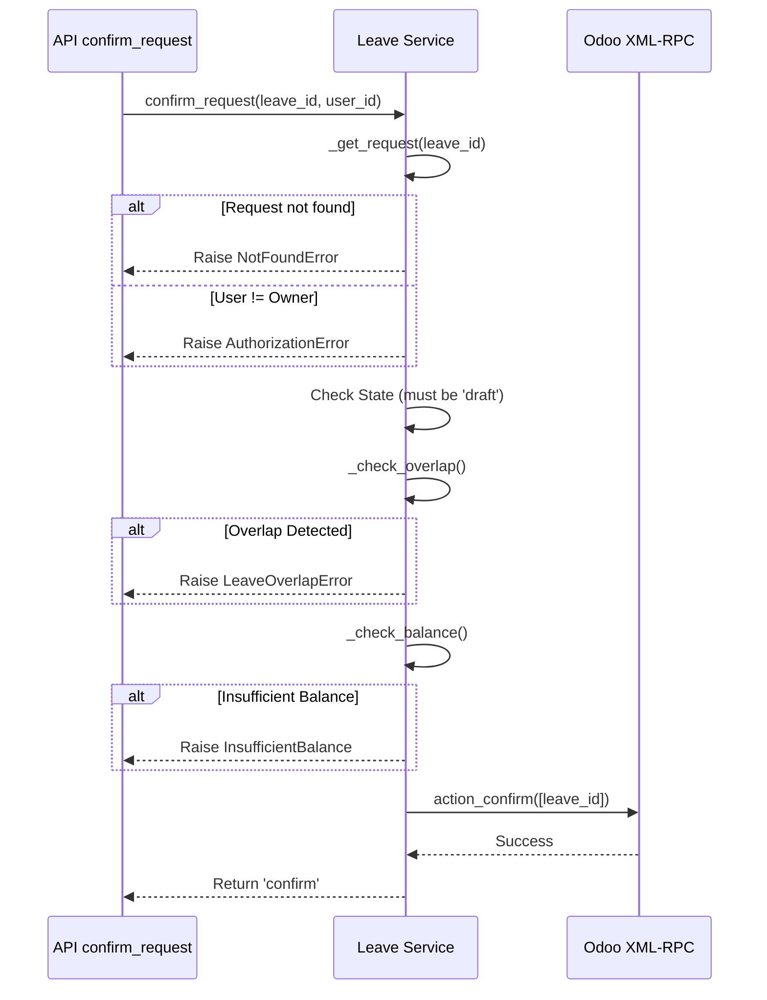

# Giải thích Luồng Nghỉ Phép (Leave Flow)

Tài liệu này phân tích chi tiết mã nguồn của **`LeaveService`** (`backend/app/services/leave_service.py`), bao gồm quy trình tạo đơn, duyệt đơn và logic kiểm tra phép tồn (Leave Balance).

## 1. Tổng quan & Trạng thái (State)

Quy trình nghỉ phép trong Odoo đi qua các trạng thái sau:



- **Draft (Nháp)**: Đơn mới tạo, chưa gửi đi.
- **Confirm (Chờ duyệt)**: Đã gửi, chờ quản lý duyệt. **Đây là bước kiểm tra logic quan trọng nhất.**
- **Validate (Đã duyệt)**: Đơn đã được chấp nhận, ngày phép chính thức bị trừ.
- **Refuse (Từ chối)**: Đơn bị hủy.

---

## 2. Tạo & Gửi đơn (`create_request` & `confirm_request`)

Đây là 2 bước tách biệt để cho phép user sửa đổi trước khi gửi chốt.

### Sơ đồ Logic (Gửi đơn)



### Chi tiết Code

#### A. Tạo Nháp (`create_request`)

```python
vals = {
    'employee_id': employee_id,
    'holiday_status_id': leave_type_id, # Loại nghỉ (Phép năm, Ốm...)
    'request_date_from': date_from,
    'request_date_to': date_to,
    'name': description
}
odoo_client.execute_kw('hr.leave', 'create', [vals])
```

- Chỉ đơn giản là tạo bản ghi, chưa kiểm tra logic nghiệp vụ sâu.

#### B. Gửi xác nhận (`confirm_request`) - **Logic Phức tạp**

1.  **Kiểm tra Trùng lặp (`_check_overlap`)**:

    - Mục đích: Không cho phép tạo đơn mới nếu ngày xin nghỉ chồng lấn lên một đơn _đã gửi_ hoặc _đã duyệt_ khác.
    - **Query Odoo**:
      ```python
      domain = [
          ['employee_id', '=', employee_id],
          ['state', 'in', ['confirm', 'validate', 'validate1']],
          ['request_date_from', '<=', date_to], # Logic giao nhau
          ['request_date_to', '>=', date_from]
      ]
      ```
    - Nếu `count > 0` -> Báo lỗi `LeaveOverlapError`.

2.  **Kiểm tra Số dư phép (`_check_balance`)**:

    - Mục đích: Không cho nghỉ lố số ngày được cấp.
    - **Logic**:
      - Gọi phương thức Odoo `get_employees_days` (nếu có hỗ trợ) để lấy số ngày còn lại của loại nghỉ đó.
      - So sánh: `remaining_leaves >= request.number_of_days`.
    - Nếu thiếu -> Báo lỗi `OdooAPIError("Insufficient leave balance")`.

3.  **Chuyển trạng thái**:
    - Gọi method `action_confirm` của Odoo để chuyển đơn sang trạng thái chờ duyệt.

---

## 3. Quản lý Duyệt/Từ chối

Dành cho role Manager.

- **Duyệt (`approve_request`)**:

  ```python
  odoo_client.execute_kw('hr.leave', 'action_validate', [[leave_id]])
  ```

  - Chuyển trạng thái sang `validate`. Lúc này ngày phép mới thực sự bị trừ vào quỹ phép (Allocated Days).

- **Từ chối (`reject_request`)**:
  ```python
  odoo_client.execute_kw('hr.leave', 'action_refuse', [[leave_id]])
  ```
  - Chuyển sang `refuse`.

---

## 4. Kiểm tra Phép tồn (`get_balance`)

Đây là hàm **khó nhất** vì quy định tính phép của Odoo khá phức tạp và thay đổi theo version. Service này đang cài đặt logic **tính toán thủ công** để đảm bảo hoạt động được trên nhiều môi trường.

**Công thức**: `Remaining = Allocated (Được cấp) - Taken (Đã dùng)`

### Logic Code

1.  **Lấy Tổng Cấp (`Allocated`)**:

    - Query bảng `hr.leave.allocation`.
    - Điều kiện: [`state`, `=`, `validate`] (Chỉ tính đơn cấp phép đã duyệt).
    - Cộng dồn `number_of_days` theo từng loại nghỉ (`holiday_status_id`).

2.  **Lấy Tổng Dùng (`Taken`)**:

    - Query bảng `hr.leave`.
    - Điều kiện: [`state`, `in`, `['confirm', 'validate', 'validate1']`].
    - **Lưu ý**: Tính cả đơn _Đang chờ duyệt_ (`confirm`) vào số đã dùng để tránh trường hợp user spam đơn liên tục vượt quá quỹ phép trước khi manager kịp duyệt.

3.  **Tổng hợp**:
    - Loop qua 2 danh sách trên và trừ ra số dư cuối cùng.

```python
result = []
for type_id in all_types:
    remaining = allocated[type_id] - taken[type_id]
    result.append({
        'name': type_name,
        'remaining': remaining,
        ...
    })
```

---

## 5. Các hàm bổ trợ khác

### A. Lấy lịch sử nghỉ phép (`get_history`)

```python
def get_history(self, employee_id: int, limit: int = 20) -> List[Dict]:
    domain = [['employee_id', '=', employee_id]]
    return odoo_client.search_read('hr.leave', domain, ..., order='request_date_from desc')
```

- Lấy danh sách đơn nghỉ phép của nhân viên, sắp xếp ngày mới nhất lên đầu.

### B. Lấy loại nghỉ phép (`get_leave_types`)

```python
def get_leave_types(self) -> List[Dict]:
    return odoo_client.search_read('hr.leave.type', [], ['id', 'name', 'allocation_validation_type'])
```

- Lấy danh sách các loại nghỉ (Phép năm, Ốm, Việc riêng...) để hiển thị trong dropdown khi tạo đơn.

### C. Lấy đơn chờ duyệt (`get_pending_requests`)

```python
def get_pending_requests(self, manager_employee_id: int) -> List[Dict]:
    # Hiện tại đang lấy tất cả đơn có state='confirm'
    domain = [['state', '=', 'confirm']]
    return odoo_client.search_read('hr.leave', domain, ...)
```

- **Lưu ý**: Logic hiện tại đang lấy **toàn bộ** đơn chờ duyệt trong hệ thống. Cần cải tiến để chỉ lấy đơn của nhân viên cấp dưới (`department_id` hoặc `parent_id`) trong tương lai.

### D. Các hàm Validate nội bộ (Internal Helpers)

#### `_check_overlap`

Kiểm tra xem khoảng thời gian nghỉ có bị trùng với đơn khác không.

```python
def _check_overlap(self, employee_id: int, date_from: date, date_to: date, exclude_id: int = None) -> bool:
    domain = [
        ['employee_id', '=', employee_id],
        ['state', 'in', ['confirm', 'validate', 'validate1']],
        ['request_date_from', '<=', date_to.strftime('%Y-%m-%d')],
        ['request_date_to', '>=', date_from.strftime('%Y-%m-%d')]
    ]
    if exclude_id:
        domain.append(['id', '!=', exclude_id])

    count = odoo_client.execute_kw('hr.leave', 'search_count', [domain])
    return count > 0
```

#### `_check_balance`

Kiểm tra số dư phép bằng cách gọi hàm `get_employees_days` của Odoo (nếu có).

```python
def _check_balance(self, employee_id: int, type_id: int, days_needed: float) -> bool:
     try:
        allocations = odoo_client.execute_kw('hr.leave', 'get_employees_days', [[employee_id]])
        if not allocations or employee_id not in allocations:
            return False
        type_data = allocations[employee_id].get(type_id)
        return type_data and type_data.get('remaining_leaves', 0) >= days_needed
     except:
         return False
```

#### `_validate_dates`

Kiểm tra ngày bắt đầu không được lớn hơn ngày kết thúc, và không được chọn ngày trong quá khứ.

```python
def _validate_dates(self, date_from: date, date_to: date):
    if date_to < date_from:
        raise OdooAPIError("End date must be greater than or equal to start date")
    if date_from < date.today():
         raise OdooAPIError("Start date cannot be in the past")
```
