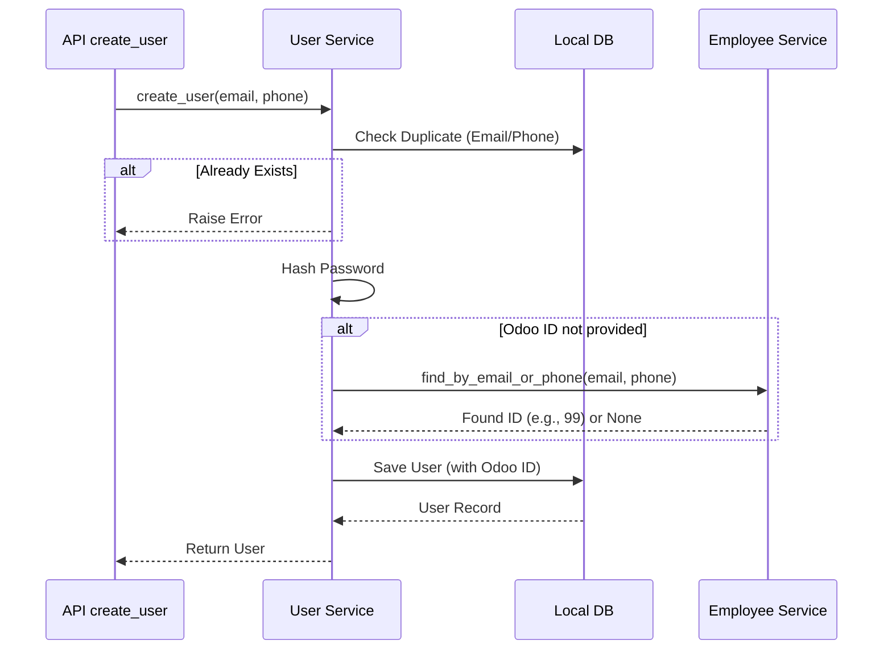

# Giải thích Luồng Người dùng (User Flow)

Tài liệu này phân tích chi tiết mã nguồn của **`UserService`** (`backend/app/services/user_service.py`). Khác với 3 service còn lại, service này hoạt động chủ yếu trên **Local Database (PostgreSQL)** để quản lý tài khoản đăng nhập, nhưng có cơ chế **Auto-link** đặc biệt để kết nối với Odoo.

## 1. Cơ chế Tự động Liên kết (Auto-linking)

Hệ thống Bestmix Pro cho phép tạo user local trước, sau đó tự động tìm và map với nhân viên trong Odoo dựa trên Email hoặc SĐT.

### Sơ đồ Logic (Tạo User)



### Chi tiết Code

(`backend/app/services/user_service.py`)

#### A. Hàm `create_user`

1.  **Kiểm tra trùng lặp Local**:

    - Query DB local xem `email` hoặc `phone` đã được tài khoản nào dùng chưa. Nếu có -> Báo lỗi ngay.

2.  **Logic Auto-link**:

    ```python
    odoo_employee_id = user_in.odoo_employee_id
    if not odoo_employee_id:
        # Gọi sang EmployeeService để tìm trong Odoo
        odoo_employee_id = employee_service.find_by_email_or_phone(
            user_in.email, user_in.phone
        )
    ```

    - Nếu lúc tạo user, admin không nhập ID Odoo, hệ thống sẽ tự đi tìm xem có nhân viên nào trong Odoo dùng chung Email/SĐT đó không.
    - **Lợi ích**: Giúp đồng bộ user cũ vào hệ thống mới mà không cần mapping thủ công từng người.

3.  **Lưu User**:
    - Mật khẩu được mã hóa bằng `bcrypt` trước khi lưu (`user_in.password_hash`).

#### B. Hàm `update_user` (Cập nhật User)

Logic tương tự cũng được áp dụng khi cập nhật thông tin:

```python
if 'odoo_employee_id' not in update_data:
    # Nếu user đổi Email hoặc Phone
    if new_email is not None or new_phone is not None:
        # Hệ thống tự chạy lại logic tìm kiếm để update liên kết
        found_id = employee_service.find_by_email_or_phone(final_email, final_phone)
        update_data['odoo_employee_id'] = found_id
```

- **Ví dụ**: User A ban đầu dùng email cá nhân (chưa link được Odoo). Sau đó User A đổi sang email công ty. Hệ thống sẽ ngay lập tức tìm thấy nhân viên Odoo tương ứng và tự động cập nhật `odoo_employee_id` cho User A.

---

## 2. Quản lý Đội nhóm (`get_team`)

Hàm này giúp Manager xem danh sách nhân viên cấp dưới trực tiếp.

```python
def get_team(self, manager_employee_id: int) -> List[Dict]:
    domain = [['parent_id', '=', manager_employee_id]]
    return odoo_client.search_read('hr.employee', domain, ...)
```

- **Logic Odoo**: Trong Odoo, mỗi nhân viên có field `parent_id` trỏ về người quản lý của mình.
- Backend query tất cả nhân viên có `parent_id` bằng ID của user hiện tại.

---

## 3. Các hàm CRUD và Tiện ích khác

Ngoài các luồng chính, Service cung cấp các hàm thao tác dữ liệu cơ bản.

### A. Lấy danh sách (`get_users`)

```python
def get_users(self, db: Session, skip: int = 0, limit: int = 100) -> List[User]:
    return db.query(User).order_by(User.created_at.desc()).offset(skip).limit(limit).all()
```

- **Mục đích**: Lấy danh sách user để hiển thị trang quản trị.
- **Logic**:
  - **Phân trang**: Sử dụng `skip` (bỏ qua N dòng đầu) và `limit` (lấy tối đa M dòng) để tránh tải toàn bộ database.
  - **Sắp xếp**: Mới nhất lên đầu (`created_at desc`).

### B. Lấy chi tiết (`get_user_by_id`)

```python
def get_user_by_id(self, db: Session, user_id: int) -> Optional[User]:
    return db.query(User).filter(User.id == user_id).first()
```

- **Mục đích**: Lấy thông tin 1 user cụ thể để xem hoặc sửa.
- **Kết quả**: Trả về object `User` nếu tìm thấy, ngược lại trả về `None`.

### C. Xóa User (`delete_user`)

```python
def delete_user(self, db: Session, user_id: int) -> User:
    user = self.get_user_by_id(db, user_id)
    if not user:
         raise HTTPException(status_code=404, detail="User not found")

    db.delete(user)
    db.commit()
    return user
```

- **Lưu ý quan trọng**: Hàm này chỉ xóa tài khoản đăng nhập (User Local). **Nhân viên bên Odoo vẫn giữ nguyên**, không bị ảnh hưởng. Điều này an toàn vì User Local chỉ là tài khoản để truy cập App chấm công.
